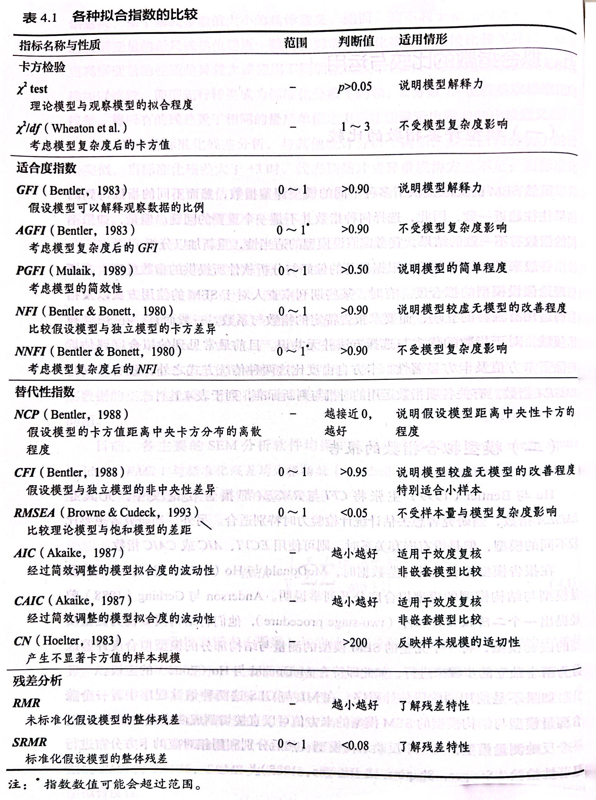

# (PART) 理论准备 {-}

# 初期理论要点 

《结构方程与建模的而原理与应用》（第二版）的前几章主要是理论阐述，并不涉及具体实操和案例。对于这部分内容，本节选取了其中与实操最为相关的部分，分章节进行了总结。

## 第一章 结构方程模型概说

该章指出，在准备进行结构方程（SEM）建模时，使用的数据需要满足以下几点要求：

1. 样本量不能低于$100$。如果追求结果的可靠和稳定，样本量不能小于$200$。
2. 如果输入的是矩阵数据，最好使用协方差矩阵而不是相关系数矩阵。因为前者包含了计算后者所有必要的信息。此外，数据化简到小数点第$3$位为宜，以提高计算精度。
3. 当数据中的变量分布明显偏离正态时，SEM的结果值得怀疑。

## 第二章 结构方程模型的组成

该章指出:

1. 纳入SEM进行分析的变量主要是*连续型变量*（定距和定比），而*类别变量*（定类和定序）只是作为辅助或分组讨论的调节变量之用。
2. *多元指标原则*：一个潜变量必须由至少$3$个测量变量来估计。
3. *简效原则*：将变量之间的关系以最符合理论意义且最简明扼要的方式加以界定。

## 第三章 参数估计与识别问题

对于SEM来说，待估参数数目 $t$ 和测量数据数（`numbers of data points, DP`）之间的关系，导致了三种识别状态——过度识别、充分识别和识别不足。

设模型外源测量变量和内生测量变量的个数分别为$p, q$，则其`DP`为：

$$
DP = \dfrac{(p + q)(p + q + 1)}{2}
$$

待估参数的数目 $t$ 则视模型设定而定。

- 当$t \leq DP$，为过度识别。
- 当$t = DP$，为充分识别，此时模型被称为饱和模型，其到处的协方差矩阵与样本观测到的协方差矩阵完全相等。
- 当$t > DP$，为识别不足，此时，SEM无法对任何参数作出估计。


## 第四章 模型拟合评鉴

- 统计检验的经典逻辑，是将偏好的模型设为备择假设，然后以推翻原假设的形式证明备择假设。然而，SEM分析策略有所不同，因为**他的原假设是“我们偏好的模型与实际观察所得数据相符”**。

  - 以似然比卡方检验为例。在一般的`Neyman-pearson hypothesis testing`中，将`restricted model`的似然值记为$L_R^*$，$L^*$则是`unrestricted model`的似然值，假设受到restricted的变量数量为$m$，那么构造的卡方统计量为：
$$
  R=-2 \ln \left(\frac{L_R^*}{L^{\star}}\right)=2\left(\ln L^*-\ln L_R^*\right) \sim f_{\chi^2}(r \mid m)
$$

  - 此时，如果$m$个受到restricted的系数都不存在效应，那么应该有$E(R)=m$，反之则为$r \gg m$（卡方值具有显著性），从而拒绝了没有效应的原假设，即拒绝了`restricted model`，接受了我们偏好的`unrestricted model`。
  - 但是，在SEM中，`restricted model` 才是我们偏好的模型，而`unrestricted model` 是一个对各观察变量之间都作了相关假定的饱和模型。此时，**具有显著性的卡方值，反而意味着我们应该拒绝自己偏好的模型**；更为糟糕的是，在假设检验的逻辑下，不具有显著性的卡方值，也不能说证实了我们的模型。总的来说，在SEM中，卡方值越接近$m$反而越好。


- 表 \@ref(fig:index-tab) 是一些常用的拟合指数（原书78页表4.1）：

```{r index-tab, echo=FALSE, fig.cap="一些常用的拟合指数"}

```


