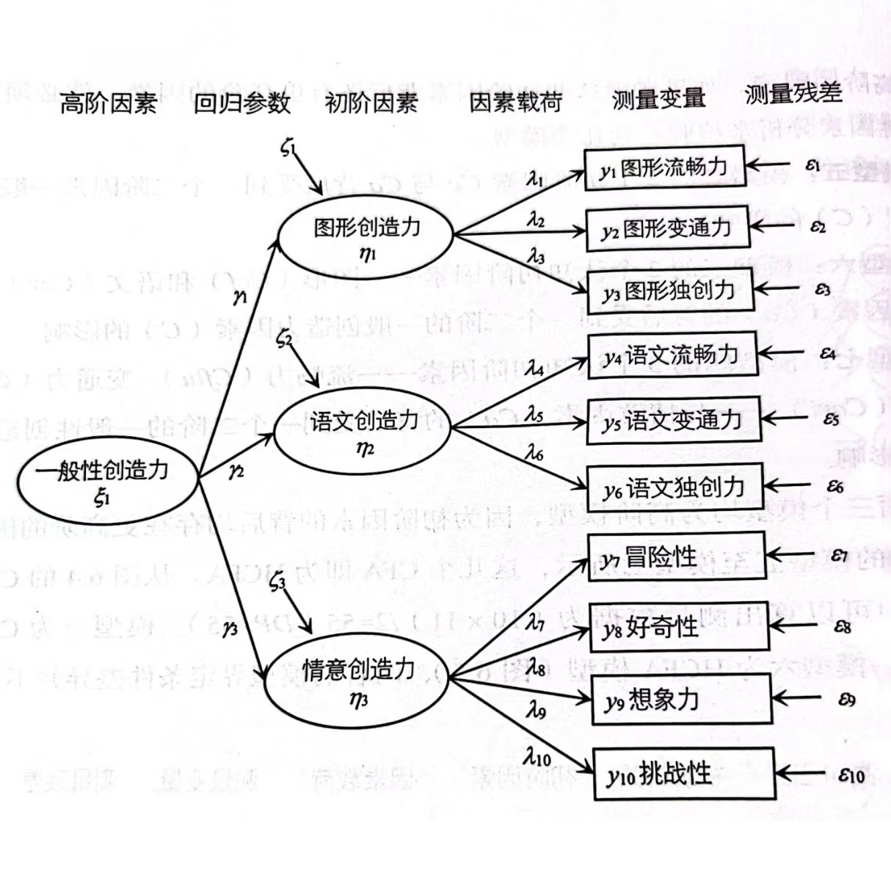
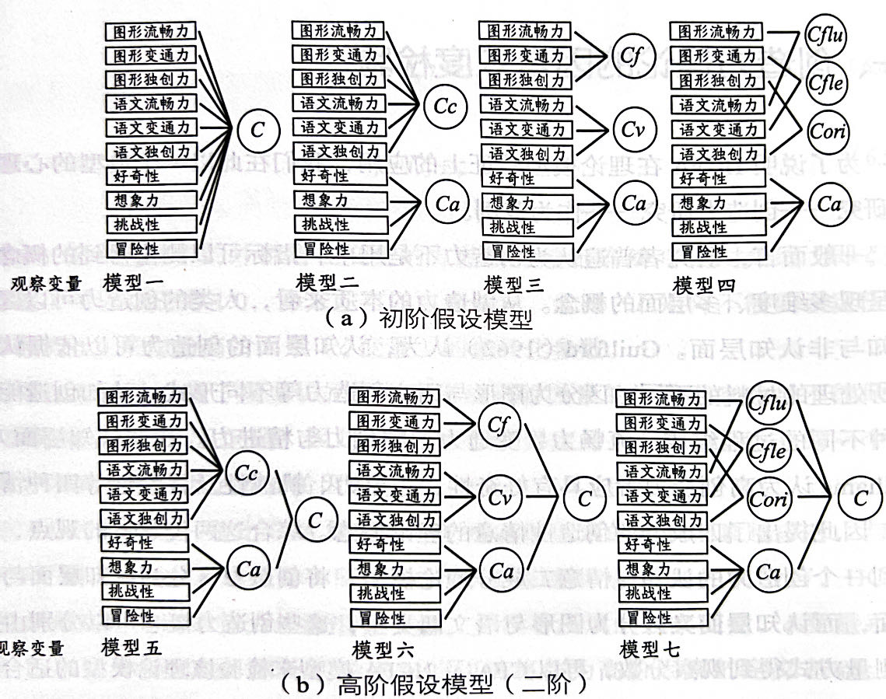

# 高阶验证性因素分析

对于测量模型，如果研究者认为潜在因素之上还有更高阶的潜在因素，那么此测量模型就被称为*阶层测量模型*（hierarchical measurement model, HCFA）。

决定使用阶层测量模型的原因可以有两种。一是理论导向，即从理论层面认为可能存在这样一些更高阶的因子；二是经验导向，即在CFA中发现某些因子具有高度相关性。

> 注意，基于模型识别的原则，形成高阶因素的初阶因素的数目不能低于$3$。

```{r message=FALSE, warning=FALSE}
library(tidyverse)
library(lavaan)
library(modelsummary)
library(semPlot)
```

## 模型界定

该HCFA的基本结构如图\@ref(fig:hcfa)所示

```{r hcfa, echo=FALSE, fig.align='center', fig.cap="HCFA模型的假设模型路径"}

```

由于有$10$个外生变量，该模型的测量数据数为$10 \times11 / 2 = 55$。

该模型有23个参数需要估计，分别为：

1. 观测变量的测量误差方差$10$个。
2. 初阶因素的载荷$10 - 3 = 7$个，其中三个被约束用来确定因子量纲。
3. 初阶因素未被高阶因素解释的部分的方差$3$个。
4. 高阶因素对于初阶因素的回归系数$3$个。
5. 高阶因素的方差$1-1=0$个，因为被设定为1。

此外，作者还设定了很多其他模型，见图\@ref(fig:hcfa-all)。

```{r hcfa-all, echo=FALSE, fig.align='center', fig.cap="各种创造力测量分数的假设模型"}

```


## 参数估计

### 变量描述

我们首先看一下变量的分布情况，见表\@ref(tab:summary-hcfa)

```{r summary-hcfa, message=FALSE, warning=FALSE}
# 读取数据
dat <- read_csv("data/ch06.csv")

datasummary_skim(dat,
                 title = "创造力测量分数的描述统计量",
                 fmt = fmt_sprintf("%.2f"))
```

### 参数估计设定

对于图\@ref(fig:hcfa)中的模型，原书169页展示的识别策略是：

- 高阶因子的方差被固定为1，载荷自由估计（由于$R$默认会自由估计方差，而固定第一个载荷，所以我们必须使用`Crea ~~1*Crea`来强制高阶因子的方差为1，用`Crea =~ NA*FA+FB+FC`中的`NA`来告诉计算机，该参数必须被估计而不是被固定）。

```{r}
mod6 <-' 
#set the first order factor structure
  FA  =~ tf1+tf2+tf3
  FB  =~ tl1+tl2+tl3
  FC  =~ w1+w2+w3+w4
#set the higher order factor structure
  Crea =~ NA*FA+FB+FC
  Crea ~~1*Crea'
mod6_fit <- cfa(mod6, data = dat)
```

然后我们可以通过`inspect`命令看一下，设定完成后有哪些参数需要估计。结果与原书169页一致：

```{r}
inspect(mod6_fit)
```

### 结果展示

```{r}
mod6_res <- summary(mod6_fit, standard = T)
print(mod6_res)
```

图\@ref(fig:cfa-paths-06)是基于完全标准化解`Std.all`的路径图：

```{r cfa-paths-06, fig.cap="模型6的拟合结果", fig.width=8, fig.height=4, cache=TRUE, fig.align='center'}
semPaths(mod6_fit, 
         what = "std") 
```

原书171页输出了高阶因素对于初阶因素的解释力，类似于回归分析的$R^2$。在该模型中，我们只需要用$1$减去FA、FB、FC三者在被标准化的情况下未被解释的方差就可以了得到该结果：

```{r}
r2 <- mod6_res$pe |>
  filter(lhs == rhs) |>
  filter(!str_detect(lhs, "\\d")) |>
  slice(2:4) |>
  pull(std.all)

str_c(round((1-r2) * 100, 1), '%')
```

## 模型拟合度分析

原书171页表6.3给出了各个模型的拟合情况比较，我们在表\@ref(tab:fit-tables6-3)重现了结果。

> 不知道为什么，这里模型7和书中的差别很大。

```{r fit-tables6-3, message=FALSE, warning=FALSE}
# 初阶假设模型
# mod1
mod1 <-' 
  C1 =~ tf1 + tf2 + tf3 + NA*tl1 + tl2 + tl3 + w1 + w2 + w3 + w4'
# mod2
mod2 <- '
  C1 =~ tf1 + tf2 + tf3 + tl1 + tl2 + tl3
  C2 =~ w1 + w2 + w3 + w4
'
# mod3
mod3 <- '
  C1 =~ tf1 + tf2 + tf3
  C2 =~ tl1 + tl2 + tl3 
  C3 =~ w1 + w2 + w3 + w4
'
# mod4
mod4 <- '
  C1 =~ tf1 + tl1
  C2 =~ tf2 + tl2
  C3 =~ tf3 + tl3
  C4 =~ w1 + w2 + w3 + w4
'
# 高阶假设模型
# mod5
mod5 <-' 
#set the first order factor structure
  C1  =~ tf1+tf2+tf3 + tl1+tl2+tl3
  C2  =~ w1+w2+w3+w4
#set the higher order factor structure
  H1 =~ C1 + C2'
# mod6
mod6 <-' 
  FA  =~ tf1+tf2+tf3
  FB  =~ tl1+tl2+tl3
  FC  =~ w1+w2+w3+w4
  Crea =~ FA+FB+FC'
#mod5
mod7 <-' 
  C1 =~ tf1 + tl1
  C2 =~ tf2 + tl2
  C3 =~ tf3 + tl3
  C4 =~ w1 + w2 + w3 + w4
  H1 =~ C1 + C2 + C3 + C4 '

# 拟合模型
all_mod <- list(mod1 = mod1, 
                mod2 = mod2,
                mod3 = mod3,
                mod4 = mod4,
                mod5 = mod5,
                mod6 = mod6,
                mod7 = mod7)

# 基于模型返回fit.measures
get_measures <- function(mymod){
  res <- cfa(mymod, data = dat) |>
    fitMeasures() |>
    as.list()
}

all_res <- map_dfr(all_mod,
               .f = ~get_measures(.))

all_res |>
  mutate(model = c("模型一", "模型二", "模型三", "模型四","模型五", "模型六", "模型七")) |>
  select(model, chisq, df, rmsea, nnfi, cfi, srmr) |>
  mutate(across(is.numeric, ~round(., 3))) |>
  knitr::kable(caption = "各模型拟合度比较表")
```


